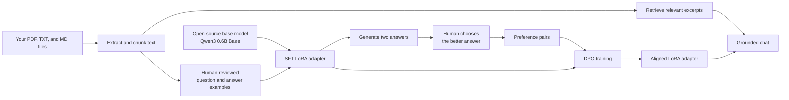

# Document-Grounded LLM Alignment with SFT, DPO, and RAG

An end-to-end educational implementation for adapting a small open-source language model to answer questions from a local document collection. The workflow combines supervised fine-tuning (SFT), human preference collection, Direct Preference Optimization (DPO), parameter-efficient LoRA adapters, and retrieval-augmented generation (RAG).

## Overview

This repository provides:

- document ingestion for PDF, plain-text, and Markdown files;
- transparent local chunking and keyword retrieval;
- tools for authoring and validating conversational SFT records;
- an interactive workflow for collecting preferred and rejected responses;
- LoRA-based SFT and DPO training with Hugging Face TRL; and
- grounded inference that reports the retrieved source chunks.

The project is designed for learning and small-scale experimentation. The included datasets are intentionally minimal and are not suitable for production training.

> [!IMPORTANT]
> This repository contains no private organizational corpus and does not redistribute the RLHF Book. Sunrise Bakery, its policies, and all included training records are fictional. Use only source documents that you own or are authorized to process and train on.

## Contents

- [Background and attribution](#background-and-attribution)
- [Architecture](#architecture)
- [Methodology](#methodology)
- [Technology stack](#technology-stack)
- [Installation](#installation)
- [Workflow](#workflow)
- [Implementation notes](#implementation-notes)
- [Troubleshooting](#troubleshooting)
- [Responsible-use checklist](#responsible-use-checklist)
- [License and attribution](#license-and-attribution)

## Background and attribution

The conceptual foundation for this tutorial is Nathan Lambert's [*Reinforcement Learning from Human Feedback*](https://rlhfbook.com/). The book provides a comprehensive treatment of instruction tuning, preference data, reward modeling, reinforcement learning, and direct-alignment algorithms.

This repository is an independent educational implementation. It is not official companion code and is not affiliated with or endorsed by Nathan Lambert. The [web edition](https://rlhfbook.com/) and [book PDF](https://rlhfbook.com/book.pdf) provide the broader theoretical context.

## Architecture

The pipeline produces an SFT adapter and a DPO-aligned adapter while keeping the source documents available to the retrieval layer. The base model is not modified in place.



## Methodology

Documents and human feedback serve different purposes in this workflow:

1. **Documents** provide current knowledge and supporting evidence.
2. **SFT records** demonstrate the expected question-answer format and response quality.
3. **Human preferences** identify which model response better satisfies the evaluation criteria.
4. **DPO** updates the adapter toward the preferred response patterns.
5. **Retrieval** supplies relevant document excerpts at inference time.

Raw documents are therefore not equivalent to human-feedback data. They must be transformed into reviewed instruction examples or used as retrieval context.

Nathan Lambert's RLHF Book describes SFT as the first post-training step and distinguishes policy-gradient RL, reward modeling, and direct-alignment methods such as DPO in [Training Overview](https://rlhfbook.com/c/03-training-overview). It also emphasizes the importance of completion quality in [Instruction Fine-Tuning](https://rlhfbook.com/c/04-instruction-tuning).

### DPO and canonical RLHF

This tutorial uses a direct-alignment workflow rather than canonical PPO-based RLHF:

| Workflow | Training stages | Operational complexity |
|---|---|---|
| Canonical RLHF | SFT → human preferences → reward model → PPO or another RL algorithm | High |
| This repository | SFT → human preferences → DPO | Moderate |

DPO is a preference fine-tuning method and direct-alignment algorithm. It learns from preferred and rejected response pairs without requiring a separate reward model or online reinforcement-learning loop. See the [DPO paper](https://arxiv.org/abs/2305.18290) and [TRL DPO documentation](https://huggingface.co/docs/trl/dpo_trainer) for the underlying method.

## Technology stack

The default model is [`Qwen/Qwen3-0.6B-Base`](https://huggingface.co/Qwen/Qwen3-0.6B-Base). It provides a practical baseline because it:

- is small enough for educational experiments;
- has 0.6 billion parameters and a 32,768-token context window;
- is distributed under the Apache 2.0 license; and
- supports the Hugging Face Transformers interface.

The implementation uses:

- **Transformers** for model loading and generation;
- **TRL** for SFT and DPO training;
- **PEFT/LoRA** for parameter-efficient adapter training;
- **PyMuPDF** for PDF text extraction; and
- a dependency-light keyword retriever that requires no API key or vector database.

The datasets use TRL's conversational formats for SFT and DPO, including the `prompt`, `chosen`, and `rejected` fields documented by the [SFT Trainer](https://huggingface.co/docs/trl/sft_trainer) and [DPO Trainer](https://huggingface.co/docs/trl/dpo_trainer).

## Hardware requirements

Document preparation and validation run on a standard computer. Model training is the resource-intensive stage.

| Environment | Recommended use |
|---|---|
| NVIDIA GPU with 12–16 GB or more | Preferred for training. Use `--use-4bit` to reduce memory consumption. Colab and Kaggle GPUs are suitable for the demonstration dataset. |
| Apple Silicon Mac | Suitable for ingestion and inference. MPS training may be slow and memory-sensitive. Do not use `--use-4bit`. |
| CPU-only computer | Suitable for ingestion and validation. Model training is generally impractical; use a hosted GPU environment. |

The eight included SFT records and two demonstration preference records are sufficient only for pipeline validation. A substantive experiment should begin with approximately 100–500 reviewed SFT examples and 50–200 genuine preference pairs, followed by held-out evaluation before further scaling.

## Repository structure

```text
document-rlhf-tutorial/
├── README.md
├── requirements.txt
├── requirements-nvidia.txt
├── data/
│   ├── source_documents/       # Put your PDF, TXT, and Markdown files here
│   ├── processed/chunks.jsonl  # Generated document excerpts
│   ├── sft.jsonl               # Included teaching examples
│   ├── sft.custom.jsonl        # Your human-authored examples
│   ├── questions.txt           # Questions used to collect preferences
│   ├── preferences.example.jsonl # Included demonstration preference pairs
│   └── preferences.jsonl       # Your generated human choices
├── outputs/
│   ├── sft_adapter/            # Generated after SFT
│   └── dpo_adapter/            # Generated after DPO
├── scripts/
│   ├── prepare_documents.py
│   ├── author_sft.py
│   ├── train_sft.py
│   ├── collect_preferences.py
│   ├── train_dpo.py
│   ├── chat.py
│   └── validate_data.py
└── tests/                       # Dependency-light regression tests
```

The tracked files under `data/` are fictional examples and are documented in [`data/README.md`](data/README.md). Additional source documents, generated chunks, custom SFT records, preference choices, environment files, and model outputs are excluded from version control because they may be private or large.

## Installation

Clone the repository, create a virtual environment, and install the standard dependencies:

```bash
git clone https://github.com/felipe-cosse/document-rlhf-tutorial.git
cd document-rlhf-tutorial
python3 -m venv .venv
source .venv/bin/activate
python -m pip install --upgrade pip
pip install -r requirements.txt
```

Run the dependency-light regression tests:

```bash
python3 -m unittest discover -s tests -v
```

On Windows PowerShell, activate with:

```powershell
.venv\Scripts\Activate.ps1
```

For NVIDIA GPU environments that require 4-bit training, install the NVIDIA dependency set instead:

```bash
pip install -r requirements-nvidia.txt
```

The first model operation downloads the model and tokenizer from Hugging Face. Cache size may vary between model revisions.

## Workflow

### 1. Prepare source documents

The repository includes two fictional Sunrise Bakery documents for immediate testing. They do not describe a real business or contain internal organizational data. Replace or supplement them with authorized source files:

```text
data/source_documents/
├── refund_policy.md
├── store_information.txt
└── your_document.pdf
```

New files in `data/source_documents/` are ignored by Git to reduce the risk of publishing private material. The two fictional examples are explicit exceptions. Confirm the behavior before adding real documents:

```bash
git check-ignore data/source_documents/your_document.pdf
```

Only use `git add -f` when a source document has been deliberately approved for publication.

Source documents should be:

- owned by you or licensed for the intended use;
- accurate and current;
- clearly written;
- free of credentials, unnecessary personal data, and other sensitive information; and
- relevant to the questions the system is expected to answer.

#### PDF text requirements

The ingestion script extracts selectable text with PyMuPDF's `page.get_text()` method. Image-only PDFs must be processed with OCR before ingestion. The script terminates with an error when a PDF contains no selectable text. See the [PyMuPDF text-extraction guide](https://pymupdf.readthedocs.io/en/latest/the-basics.html#extract-text-from-a-pdf).

### 2. Build the document corpus

Extract and chunk the source documents:

```bash
python scripts/prepare_documents.py
```

Expected output for the included examples:

```text
Prepared 2 chunks from 2 documents.
Saved: data/processed/chunks.jsonl
```

The script:

1. discovers supported `.pdf`, `.txt`, `.md`, and `.markdown` files;
2. extracts and normalizes their text;
3. creates overlapping chunks; and
4. preserves source filenames and chunk identifiers.

Inspect the result:

```bash
python -m json.tool --json-lines data/processed/chunks.jsonl | sed -n '1,80p'
```

Adjust the chunk and overlap sizes when required:

```bash
python scripts/prepare_documents.py --max-words 350 --overlap-words 50
```

### 3. Create the SFT dataset

Each supervised fine-tuning record contains a user request and an ideal assistant response.

The included `data/sft.jsonl` contains eight examples. A simplified record has the following structure:

```json
{
  "messages": [
    {"role": "user", "content": "Reference excerpt ... Question: When are you open?"},
    {"role": "assistant", "content": "On Sunday, 8 a.m. to 1 p.m."}
  ]
}
```

Each prompt includes its supporting source excerpt so the model learns the expected evidence-grounded response format.

Validate the included examples:

```bash
python scripts/validate_data.py --sft data/sft.jsonl
```

#### Author custom examples

Use the interactive authoring tool to create reviewed examples:

```bash
python scripts/author_sft.py --limit 20
```

For each excerpt, the tool requests:

1. a realistic question a user might ask; and
2. the best answer supported by that excerpt.

Records are saved to `data/sft.custom.jsonl`. Validate them before training:

```bash
python scripts/validate_data.py --sft data/sft.custom.jsonl
```

High-quality answers should:

- be factually supported by the displayed excerpt;
- say “I do not know” when the excerpt lacks the answer;
- use the intended production tone and level of detail;
- avoid invented details; and
- cover normal cases, exceptions, and ambiguous questions.

### 4. Train the SFT adapter

Run the included dataset as a pipeline smoke test:

```bash
python scripts/train_sft.py --data data/sft.jsonl
```

On an NVIDIA GPU, enable QLoRA-style 4-bit loading to reduce memory usage:

```bash
python scripts/train_sft.py --data data/sft.jsonl --use-4bit
```

The official Transformers documentation recommends the NF4 data type when training 4-bit base models; the script applies that configuration. See [Transformers bitsandbytes documentation](https://huggingface.co/docs/transformers/quantization/bitsandbytes).

To train with reviewed custom examples:

```bash
python scripts/train_sft.py \
  --data data/sft.custom.jsonl \
  --output outputs/sft_adapter \
  --epochs 3 \
  --use-4bit
```

Remove `--use-4bit` if you are not using an NVIDIA GPU.

The resulting adapter is written to:

```text
outputs/sft_adapter/
```

This directory contains only the learned LoRA adapter and tokenizer configuration, not another full copy of the base model.

### 5. Collect human preference data

Edit `data/questions.txt` to contain one realistic question per line. Reserve a separate set of questions for evaluation to avoid training-test overlap.

Then run:

```bash
python scripts/collect_preferences.py
```

The program will:

1. retrieve relevant excerpts from your documents;
2. ask the SFT model to produce two different answers;
3. randomize the display order without claiming either is correct; and
4. ask you to select `1`, `2`, skip, or quit.

A saved preference record has this shape:

```json
{
  "prompt": [{"role": "user", "content": "Reference ... Question ..."}],
  "chosen": [{"role": "assistant", "content": "The better answer"}],
  "rejected": [{"role": "assistant", "content": "The worse answer"}]
}
```

Evaluate each pair with a consistent rubric:

1. Is every claim supported by the excerpt?
2. Does it answer the actual question?
3. Does it clearly state uncertainty or missing information?
4. Is it concise and easy to understand?
5. Is its tone appropriate?

Skip pairs when both answers are incorrect or materially equivalent. Low-quality preference labels directly weaken the training signal.

The collector records completed questions, randomized display order, and generation settings, and supports resuming a later session. Validate the resulting dataset:

```bash
python scripts/validate_data.py --preferences data/preferences.jsonl
```

`data/preferences.example.jsonl` demonstrates the expected format and is explicitly marked as synthetic demonstration data. It is not a substitute for human evaluation.

### 6. Train the DPO adapter

Run:

```bash
python scripts/train_dpo.py
```

Or on an NVIDIA GPU:

```bash
python scripts/train_dpo.py --use-4bit
```

DPO compares the likelihood of the chosen and rejected answers relative to the starting SFT model. The optimization updates the adapter toward the preferred response patterns. With `ref_model=None`, TRL uses the initial policy as the reference model.

The result is saved at:

```text
outputs/dpo_adapter/
```

The defaults are intentionally conservative:

- one DPO epoch;
- learning rate `1e-5`;
- DPO beta `0.1`; and
- LoRA rather than full-model training.

Additional training is not necessarily beneficial. Excessive optimization on a small preference dataset can reduce generalization and produce overly narrow behavior.

### 7. Run inference

Run a single query:

```bash
python scripts/chat.py "What is the delivery fee for five miles?"
```

Start an interactive session:

```bash
python scripts/chat.py
```

The inference script retrieves relevant excerpts, passes them to the aligned model, prints the response, and lists the source chunks used as context.

The dependency-light retriever removes common question words and requires at least 60% of a multi-term query's content words to match, with a minimum of two matches. This conservative rule favors returning no excerpt over presenting an incidental lexical match as evidence. Single-term content queries remain supported.

To test the SFT adapter before DPO:

```bash
python scripts/chat.py \
  --adapter outputs/sft_adapter \
  "Can the bakery guarantee no allergen cross-contact?"
```

To compare against the unmodified base model:

```bash
python scripts/chat.py --base-only "When is the bakery open Sunday?"
```

### 8. Evaluate the model

Evaluate all model variants on questions that were excluded from training.

Create 20–50 held-out questions representing:

- straightforward questions;
- questions requiring an exception or date calculation;
- questions whose answer is absent;
- unclear or misspelled questions;
- potentially unsafe questions; and
- questions from different documents.

For each question, compare the base, SFT, and DPO versions using the same retrieved excerpts. Score them from 0 to 2 on:

| Criterion | 0 | 1 | 2 |
|---|---|---|---|
| Groundedness | Invents facts | Mixed | Fully supported |
| Correctness | Wrong | Partly right | Correct |
| Helpfulness | Not useful | Adequate | Clear and useful |
| Uncertainty | Pretends to know | Vague | Correctly says what is missing |
| Style | Poor | Acceptable | Desired style |

Do not deploy the adapter unless it improves held-out results without introducing material regressions. Human review remains necessary for medical, legal, financial, employment, safety, and other high-impact use cases.

## Implementation notes

### PDF text extraction

The ingestion script follows PyMuPDF's basic extraction pattern:

```python
import pymupdf

with pymupdf.open(path) as document:
    for page in document:
        text = page.get_text("text", sort=True)
```

### Parameter-efficient fine-tuning

`train_sft.py` configures LoRA for all linear layers:

```python
lora = LoraConfig(
    r=16,
    lora_alpha=32,
    target_modules="all-linear",
    task_type="CAUSAL_LM",
)
```

This configuration trains a small adapter rather than updating every base-model parameter.

### Preference record format

DPO records contain a prompt, a preferred response, and a rejected response:

```python
record = {
    "prompt": [{"role": "user", "content": question_with_references}],
    "chosen": [{"role": "assistant", "content": better_answer}],
    "rejected": [{"role": "assistant", "content": worse_answer}],
}
```

### Retrieval-grounded inference

`chat.py` retrieves matching excerpts and builds a prompt that says:

```text
Answer using only the reference excerpts.
If the answer is not in them, say you do not know.

[1] Source: ...
...

Question: ...
```

Fine-tuning shapes response behavior, while retrieval provides current source material. This separation allows document updates to be ingested without retraining the adapter unless the desired behavior or response style also changes.

## Troubleshooting

### `No selectable text found ... It may need OCR`

The PDF is likely image-only. Apply OCR with a tool such as OCRmyPDF, then run ingestion again.

### CUDA out of memory

Apply the following mitigations in order:

1. add `--use-4bit`;
2. lower `--max-length` to `512`;
3. keep `--batch-size 1`;
4. increase gradient accumulation instead of batch size; or
5. use a GPU with more memory.

### `--use-4bit requires a CUDA-capable GPU`

Remove `--use-4bit` on a Mac or CPU machine. This tutorial intentionally limits that option to the most predictable bitsandbytes setup.

### Limited response quality after the demonstration run

The included eight examples validate the pipeline but are insufficient for meaningful alignment. Improve the dataset before increasing the number of epochs:

- add more realistic and varied SFT examples;
- correct weak ideal answers;
- gather real preference choices;
- add examples where the correct answer is “I do not know”; and
- check that retrieval found the right excerpt.

### Instruction-following behavior does not improve

Ensure that SFT prompts reflect the intended inference format and include both reference excerpts and explicit response expectations. Raw document text alone is not an instruction dataset.

### Responses use outdated information

Re-run:

```bash
python scripts/prepare_documents.py
```

The inference workflow uses the regenerated chunks immediately. Retraining is necessary only when the desired behavior or answer style changes substantially.

## Responsible-use checklist

Before training or publishing an adapter:

- [ ] I own the files or have permission to use them for model training.
- [ ] I checked the base model's license for my planned use.
- [ ] I removed secrets and unnecessary personal information.
- [ ] I separated training questions from evaluation questions.
- [ ] A person reviewed the SFT answers.
- [ ] A person—not an automatic script—made the preference choices.
- [ ] I will not treat this small model as an authority in high-stakes decisions.
- [ ] I will keep source citations visible to users.

## Roadmap

Potential extensions include:

1. replace keyword retrieval with an embedding-based vector retriever;
2. add a browser interface with Gradio or another local UI;
3. record reasons for each preference, not only the winner;
4. add automatic checks for unsupported claims and source coverage;
5. compare multiple seeds and checkpoints on a fixed evaluation set; and
6. move to a larger Apache-licensed model only after the data and evaluation process are sound.

The primary value of this project is the reviewed dataset, preference rubric, and evaluation process rather than the demonstration model itself.

## References

- Nathan Lambert's [*Reinforcement Learning from Human Feedback*](https://rlhfbook.com/): [Training Overview](https://rlhfbook.com/c/03-training-overview), [Instruction Fine-Tuning](https://rlhfbook.com/c/04-instruction-tuning), [Direct-Alignment Algorithms](https://rlhfbook.com/c/08-direct-alignment), and [Preference Data](https://rlhfbook.com/c/11-preference-data).
- [Qwen3-0.6B-Base model card](https://huggingface.co/Qwen/Qwen3-0.6B-Base).
- [TRL SFT Trainer documentation](https://huggingface.co/docs/trl/sft_trainer).
- [TRL DPO Trainer documentation](https://huggingface.co/docs/trl/dpo_trainer).
- [Transformers bitsandbytes/QLoRA documentation](https://huggingface.co/docs/transformers/quantization/bitsandbytes).
- [PyMuPDF text-extraction documentation](https://pymupdf.readthedocs.io/en/latest/the-basics.html#extract-text-from-a-pdf).
- [Direct Preference Optimization paper](https://arxiv.org/abs/2305.18290).

### Citing the RLHF Book

If the book informs your work, use the citation provided by its author:

```bibtex
@book{rlhf2026lambert,
  author = {Nathan Lambert},
  title = {Reinforcement Learning from Human Feedback},
  year = {2026},
  publisher = {Online},
  url = {https://rlhfbook.com}
}
```

## License and attribution

Copyright 2026 Felipe Cosse.

The original code, documentation, and synthetic example data in this repository are licensed under the [Apache License 2.0](LICENSE).

The RLHF Book is a separate work by Nathan Lambert. This repository references and cites the book but does not redistribute its chapters or claim them under this repository's license. The book project licenses its code under MIT and its chapters under CC BY-NC-SA 4.0; consult the [official RLHF Book repository](https://github.com/natolambert/rlhf-book) before reusing that material.

The Qwen model, Python packages, and other linked resources retain their respective licenses. They are dependencies or references and are not relicensed by this repository.
