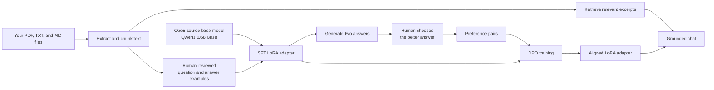

# A beginner's guide to aligning an open-source LLM with your documents and feedback

This public tutorial builds a small, private question-answering assistant from:

- an open-source language model;
- PDF, text, and Markdown files that you own or may legally use;
- good example answers written by a person; and
- human choices between better and worse model answers.

You do **not** need to understand the mathematics of machine learning to follow the workflow. The Python files are complete and runnable, and every important term is explained below.

> [!IMPORTANT]
> This repository contains no private organizational corpus and does not redistribute the RLHF Book. The included Sunrise Bakery documents and training records are fictional teaching data. For your own experiments, use only documents you own or have permission to use.

## Book and attribution

The conceptual foundation for this tutorial is [*Reinforcement Learning from Human Feedback*](https://rlhfbook.com/) by [Nathan Lambert](https://rlhfbook.com/). The book provides a broader treatment of instruction tuning, preference data, reward modeling, reinforcement learning, and direct-alignment algorithms. This repository is an independent educational example; it is not official companion code and is not affiliated with or endorsed by Nathan Lambert.

Read the [web edition](https://rlhfbook.com/) or the [book PDF](https://rlhfbook.com/book.pdf). Links to individual public chapters appear throughout this guide and in [Technical references](#technical-references).

## What you will make

Imagine a new employee with a general education but no knowledge of your organization:

- The **base model** is the new employee.
- Your **documents** are the employee handbook.
- **SFT examples** demonstrate how a good employee answers.
- **Human preferences** say, “Answer A is better than answer B.”
- **DPO** changes a small adapter so answers more often follow those preferences.
- **Retrieval**, also called RAG, opens the relevant handbook pages whenever someone asks a question.

The result is a small LoRA adapter plus a local document corpus. Your original model is not overwritten.



## An important truth: files are not human feedback

A folder of PDFs does not automatically become RLHF data.

Documents provide **knowledge and evidence**. Human feedback provides a **behavioral signal**—for example, preferring an accurate, concise, source-grounded answer over a confident invention. This tutorial uses both:

1. SFT teaches the desired question-answer pattern from ideal examples.
2. A person compares model answers.
3. DPO learns from those choices.
4. Retrieval supplies current document text every time the model is used.

Nathan Lambert's RLHF Book describes SFT as the first post-training step and distinguishes policy-gradient RL, reward modeling, and direct-alignment methods such as DPO in [Training Overview](https://rlhfbook.com/c/03-training-overview). It also emphasizes the importance of completion quality in [Instruction Fine-Tuning](https://rlhfbook.com/c/04-instruction-tuning).

### Is DPO the same as classic RLHF?

Not exactly. Precise names matter:

| Workflow | Stages | Difficulty |
|---|---|---|
| Classic RLHF | SFT → human preferences → reward model → PPO or another RL algorithm | High |
| This tutorial | SFT → human preferences → DPO | Beginner-friendly |

DPO is preference fine-tuning, also called a direct-alignment algorithm. It solves the same practical alignment problem using preferred/rejected answer pairs, without a separate reward model or online RL loop. The [DPO paper](https://arxiv.org/abs/2305.18290) and current [TRL DPO documentation](https://huggingface.co/docs/trl/dpo_trainer) explain this relationship. Calling this “classic PPO-based RLHF” would be inaccurate; calling it a practical human-feedback alignment workflow is accurate.

## Why this model and these tools?

The default model is [`Qwen/Qwen3-0.6B-Base`](https://huggingface.co/Qwen/Qwen3-0.6B-Base):

- it is small enough for learning and experimentation;
- it has 0.6 billion parameters and a 32,768-token context window;
- it uses the Apache 2.0 license; and
- its official model card supports Hugging Face Transformers.

The tutorial uses:

- **Transformers** to load and run the model;
- **TRL** for SFT and DPO training;
- **PEFT/LoRA** to train small adapter weights instead of the entire model;
- **PyMuPDF** to extract selectable text from PDFs; and
- a transparent local keyword retriever, so no API key or vector service is required.

Current TRL supports conversational datasets, SFT adapters, and DPO preference records with `prompt`, `chosen`, and `rejected` fields. See the official [SFT Trainer](https://huggingface.co/docs/trl/sft_trainer) and [DPO Trainer](https://huggingface.co/docs/trl/dpo_trainer) pages.

## Hardware and time

The data-preparation scripts run on an ordinary computer. Training is the expensive part.

| Computer | What to expect |
|---|---|
| NVIDIA GPU with 12–16 GB or more | Recommended. Use `--use-4bit` to reduce memory. A Colab or Kaggle GPU is suitable for the small demo. |
| Apple Silicon Mac | Ingestion and chat work. Training may work with MPS, but it can be slow and memory-sensitive. Do not add `--use-4bit`. |
| CPU-only computer | Ingestion works. Model training is extremely slow; use a hosted GPU instead. |

The included eight SFT records and two example preference records are only a **smoke test**. They prove the pipeline runs; they will not create a production-quality assistant. For a real project, begin with roughly 100–500 carefully reviewed SFT examples and at least 50–200 genuine preference choices, then evaluate before expanding. Quality matters more than blindly generating many rows.

## Folder map

```text
document-rlhf-tutorial/
├── README.md
├── requirements.txt
├── requirements-nvidia.txt
├── data/
│   ├── source_documents/       # Put your PDF, TXT, and Markdown files here
│   ├── processed/chunks.jsonl  # Generated document excerpts
│   ├── sft.jsonl               # Included teaching examples
│   ├── sft.custom.jsonl        # Your human-authored examples
│   ├── questions.txt           # Questions used to collect preferences
│   ├── preferences.example.jsonl # Included demonstration preference pairs
│   └── preferences.jsonl       # Your generated human choices
├── outputs/
│   ├── sft_adapter/            # Generated after SFT
│   └── dpo_adapter/            # Generated after DPO
└── scripts/
    ├── prepare_documents.py
    ├── author_sft.py
    ├── train_sft.py
    ├── collect_preferences.py
    ├── train_dpo.py
    ├── chat.py
    └── validate_data.py
```

The tracked files under `data/` are fictional examples and are documented in [`data/README.md`](data/README.md). Generated chunks, custom SFT records, preference choices, environment files, and model outputs are ignored by Git by default because they can be private or large.

## Step 0: install the software

Open a terminal in the repository, then enter:

```bash
cd document-rlhf-tutorial
python3 -m venv .venv
source .venv/bin/activate
python -m pip install --upgrade pip
pip install -r requirements.txt
```

On Windows PowerShell, activate with:

```powershell
.venv\Scripts\Activate.ps1
```

For an NVIDIA GPU and 4-bit training, install the NVIDIA list instead:

```bash
pip install -r requirements-nvidia.txt
```

The first model command downloads roughly the model and tokenizer files from Hugging Face. The exact cache size can change between model revisions.

## Step 1: add PDF, text, and Markdown files

Two fictional Sunrise Bakery files are included so the example works immediately. They do not describe a real business or use internal organizational data. Replace them with your own properly licensed files when ready:

```text
data/source_documents/
├── refund_policy.md
├── store_information.txt
└── your_document.pdf
```

Good source material is:

- legally usable;
- accurate and current;
- written clearly;
- free of unnecessary passwords, personal data, or secrets; and
- focused on the questions users will actually ask.

### PDF warning

The script extracts selectable text using PyMuPDF's documented `page.get_text()` method. A scanned PDF is a collection of images, so it may contain no selectable text. Run OCR on scanned documents first. The script stops with a clear message instead of silently ingesting an empty PDF. See the official [PyMuPDF text-extraction guide](https://pymupdf.readthedocs.io/en/latest/the-basics.html#extract-text-from-a-pdf).

## Step 2: extract and split the documents

Run:

```bash
python scripts/prepare_documents.py
```

Expected output for the included files resembles:

```text
Prepared 2 chunks from 2 documents.
Saved: data/processed/chunks.jsonl
```

What happened? The script:

1. found every `.pdf`, `.txt`, `.md`, and `.markdown` file;
2. extracted its text;
3. split long text into overlapping excerpts; and
4. saved the source filename with every excerpt.

Inspect the result:

```bash
python -m json.tool --json-lines data/processed/chunks.jsonl | head -80
```

For unusually long or short documents, change chunk size:

```bash
python scripts/prepare_documents.py --max-words 350 --overlap-words 50
```

## Step 3: create good SFT examples

SFT means **supervised fine-tuning**. Each example shows a user request followed by the ideal assistant response.

The included `data/sft.jsonl` has eight examples. One simplified record looks like this:

```json
{
  "messages": [
    {"role": "user", "content": "Reference excerpt ... Question: When are you open?"},
    {"role": "assistant", "content": "On Sunday, 8 a.m. to 1 p.m."}
  ]
}
```

The source excerpt is included in the prompt. This teaches the model to use evidence rather than merely trying to memorize a policy.

Validate the included examples:

```bash
python scripts/validate_data.py --sft data/sft.jsonl
```

### Create examples from your own files

Run the interactive authoring tool:

```bash
python scripts/author_sft.py --limit 20
```

For each excerpt, it asks you for:

1. a realistic question a user might ask; and
2. the best answer supported by that excerpt.

It saves your work to `data/sft.custom.jsonl`. Validate it:

```bash
python scripts/validate_data.py --sft data/sft.custom.jsonl
```

Good answers should:

- be factually supported by the displayed excerpt;
- say “I do not know” when the excerpt lacks the answer;
- use the tone and length you want in the final assistant;
- avoid invented details; and
- cover normal cases, exceptions, and ambiguous questions.

## Step 4: run SFT

First run the tiny included smoke test:

```bash
python scripts/train_sft.py --data data/sft.jsonl
```

On an NVIDIA GPU, reduce memory use with QLoRA-style 4-bit loading:

```bash
python scripts/train_sft.py --data data/sft.jsonl --use-4bit
```

The official Transformers documentation recommends the NF4 data type when training 4-bit base models; the script applies that configuration. See [Transformers bitsandbytes documentation](https://huggingface.co/docs/transformers/quantization/bitsandbytes).

For your reviewed examples:

```bash
python scripts/train_sft.py \
  --data data/sft.custom.jsonl \
  --output outputs/sft_adapter \
  --epochs 3 \
  --use-4bit
```

Remove `--use-4bit` if you are not using an NVIDIA GPU.

The important output is:

```text
outputs/sft_adapter/
```

This directory contains only the learned LoRA adapter and tokenizer configuration, not another full copy of the base model.

## Step 5: collect real human preferences

Edit `data/questions.txt` so it contains realistic questions about your documents, one per line. Keep some questions aside for evaluation so the training set is not also the test.

Then run:

```bash
python scripts/collect_preferences.py
```

The program will:

1. retrieve relevant excerpts from your documents;
2. ask the SFT model to produce two different answers;
3. display both answers without claiming either is correct; and
4. ask you to select `1`, `2`, skip, or quit.

A saved preference record has this shape:

```json
{
  "prompt": [{"role": "user", "content": "Reference ... Question ..."}],
  "chosen": [{"role": "assistant", "content": "The better answer"}],
  "rejected": [{"role": "assistant", "content": "The worse answer"}]
}
```

That is the human-feedback step. Judge answers using one consistent rubric:

1. Is every claim supported by the excerpt?
2. Does it answer the actual question?
3. Does it clearly state uncertainty or missing information?
4. Is it concise and easy to understand?
5. Is its tone appropriate?

If both answers are wrong or essentially identical, skip the pair. A false preference label teaches the wrong lesson.

The collector remembers completed questions, so you can quit and resume later. Validate the result:

```bash
python scripts/validate_data.py --preferences data/preferences.jsonl
```

`data/preferences.example.jsonl` shows the format but is explicitly marked as demonstration data. It is not a substitute for your own choices.

## Step 6: align the adapter with DPO

Run:

```bash
python scripts/train_dpo.py
```

Or on an NVIDIA GPU:

```bash
python scripts/train_dpo.py --use-4bit
```

DPO compares the probability of the chosen answer with the probability of the rejected answer, relative to the starting SFT model. It nudges the adapter toward the pattern in your selections. TRL uses the initial policy as its reference when `ref_model=None`, which is how the script is configured.

The result is saved at:

```text
outputs/dpo_adapter/
```

The defaults are intentionally conservative:

- one DPO epoch;
- learning rate `1e-5`;
- DPO beta `0.1`; and
- LoRA rather than full-model training.

More training is not automatically better. Too many epochs on a tiny preference set can make the model worse or overly narrow.

## Step 7: use the assistant

Ask one question:

```bash
python scripts/chat.py "What is the delivery fee for five miles?"
```

Start an interactive chat:

```bash
python scripts/chat.py
```

The chat program retrieves relevant excerpts, sends them to the aligned model, prints the answer, and lists the source chunks it used.

You can also test the SFT adapter before DPO:

```bash
python scripts/chat.py \
  --adapter outputs/sft_adapter \
  "Can the bakery guarantee no allergen cross-contact?"
```

Or compare with the untouched base model:

```bash
python scripts/chat.py --base-only "When is the bakery open Sunday?"
```

## Step 8: evaluate before trusting it

Never judge a model using only the examples it trained on.

Create 20–50 held-out questions representing:

- straightforward questions;
- questions requiring an exception or date calculation;
- questions whose answer is absent;
- unclear or misspelled questions;
- potentially unsafe questions; and
- questions from different documents.

For each question, compare the base, SFT, and DPO versions using the same retrieved excerpts. Score them from 0 to 2 on:

| Criterion | 0 | 1 | 2 |
|---|---|---|---|
| Groundedness | Invents facts | Mixed | Fully supported |
| Correctness | Wrong | Partly right | Correct |
| Helpfulness | Not useful | Adequate | Clear and useful |
| Uncertainty | Pretends to know | Vague | Correctly says what is missing |
| Style | Poor | Acceptable | Desired style |

Do not deploy unless the DPO model improves the held-out results without introducing serious new failures. Keep a person in the loop for medical, legal, financial, safety, employment, or other high-stakes decisions.

## The most important code, explained

### Reading a PDF

The ingestion script follows PyMuPDF's basic extraction pattern:

```python
import pymupdf

with pymupdf.open(path) as document:
    for page in document:
        text = page.get_text("text", sort=True)
```

### Training only a small adapter

`train_sft.py` configures LoRA for all linear layers:

```python
lora = LoraConfig(
    r=16,
    lora_alpha=32,
    target_modules="all-linear",
    task_type="CAUSAL_LM",
)
```

This is much cheaper than changing every base-model weight.

### Expressing a preference

DPO needs three things:

```python
record = {
    "prompt": [{"role": "user", "content": question_with_references}],
    "chosen": [{"role": "assistant", "content": better_answer}],
    "rejected": [{"role": "assistant", "content": worse_answer}],
}
```

### Grounding the final answer

`chat.py` retrieves matching excerpts and builds a prompt that says:

```text
Answer using only the reference excerpts.
If the answer is not in them, say you do not know.

[1] Source: ...
...

Question: ...
```

Fine-tuning shapes behavior; retrieval supplies current facts. Keeping these jobs separate makes document updates easier because you can re-run ingestion without re-training the model every time a policy changes.

## Common problems

### `No selectable text found ... It may need OCR`

The PDF is probably scanned. Apply OCR with a tool such as OCRmyPDF, then run ingestion again.

### CUDA out of memory

Try, in order:

1. add `--use-4bit`;
2. lower `--max-length` to `512`;
3. keep `--batch-size 1`;
4. increase gradient accumulation instead of batch size; or
5. use a GPU with more memory.

### `--use-4bit requires a CUDA-capable GPU`

Remove `--use-4bit` on a Mac or CPU machine. This tutorial intentionally limits that option to the most predictable bitsandbytes setup.

### The answers are poor after the demo run

That is expected. Eight examples are not enough. Improve the data before increasing epochs:

- add more realistic and varied SFT examples;
- correct weak ideal answers;
- gather real preference choices;
- add examples where the correct answer is “I do not know”; and
- check that retrieval found the right excerpt.

### The model memorizes but does not follow instructions

Make the SFT prompts resemble real use. Include the reference excerpts and exact behaviors you want. Avoid feeding raw document text as if it were already an instruction dataset.

### The model answers from old information

Re-run:

```bash
python scripts/prepare_documents.py
```

Because chat uses retrieval, updated chunks are available immediately. Re-train only when the desired behavior or answer style changes substantially.

## Privacy, copyright, and safety checklist

Before training:

- [ ] I own the files or have permission to use them for model training.
- [ ] I checked the base model's license for my planned use.
- [ ] I removed secrets and unnecessary personal information.
- [ ] I separated training questions from evaluation questions.
- [ ] A person reviewed the SFT answers.
- [ ] A person—not an automatic script—made the preference choices.
- [ ] I will not treat this small model as an authority in high-stakes decisions.
- [ ] I will keep source citations visible to users.

## What to improve next

Once the basic workflow is reliable, useful next steps are:

1. replace keyword retrieval with an embedding-based vector retriever;
2. add a browser interface with Gradio or another local UI;
3. record reasons for each preference, not only the winner;
4. add automatic checks for unsupported claims and source coverage;
5. compare multiple seeds and checkpoints on a fixed evaluation set; and
6. move to a larger Apache-licensed model only after the data and evaluation process are sound.

The small model is a teaching tool. The durable asset is the carefully reviewed dataset, preference rubric, and evaluation set.

## Technical references

- Nathan Lambert's [*Reinforcement Learning from Human Feedback*](https://rlhfbook.com/): [Training Overview](https://rlhfbook.com/c/03-training-overview), [Instruction Fine-Tuning](https://rlhfbook.com/c/04-instruction-tuning), [Direct-Alignment Algorithms](https://rlhfbook.com/c/08-direct-alignment), and [Preference Data](https://rlhfbook.com/c/11-preference-data).
- [Qwen3-0.6B-Base model card](https://huggingface.co/Qwen/Qwen3-0.6B-Base).
- [TRL SFT Trainer documentation](https://huggingface.co/docs/trl/sft_trainer).
- [TRL DPO Trainer documentation](https://huggingface.co/docs/trl/dpo_trainer).
- [Transformers bitsandbytes/QLoRA documentation](https://huggingface.co/docs/transformers/quantization/bitsandbytes).
- [PyMuPDF text-extraction documentation](https://pymupdf.readthedocs.io/en/latest/the-basics.html#extract-text-from-a-pdf).
- [Direct Preference Optimization paper](https://arxiv.org/abs/2305.18290).

### Cite the RLHF Book

If the book informs your work, use the citation provided by its author:

```bibtex
@book{rlhf2026lambert,
  author = {Nathan Lambert},
  title = {Reinforcement Learning from Human Feedback},
  year = {2026},
  publisher = {Online},
  url = {https://rlhfbook.com}
}
```

## License and third-party attribution

Copyright 2026 Felipe Cosse.

The original code, documentation, and synthetic example data in this repository are licensed under the [Apache License 2.0](LICENSE).

The RLHF Book is a separate work by Nathan Lambert. This repository references and cites the book but does not redistribute its chapters or claim them under this repository's license. The book project licenses its code under MIT and its chapters under CC BY-NC-SA 4.0; consult the [official RLHF Book repository](https://github.com/natolambert/rlhf-book) before reusing that material.

The Qwen model, Python packages, and other linked resources retain their respective licenses. They are dependencies or references and are not relicensed by this repository.
